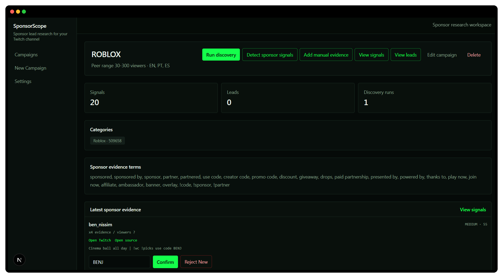

# SponsorScope

Streaming for free? SponsorScope tracks which brands are already paying similar creators and keeps the evidence attached.

It discovers peer Twitch channels, detects visible sponsorship signals, groups the evidence by creator and turns confirmed findings into outreach-ready leads.

## Why I built it

Finding potential sponsors is not mainly a contact-search problem. The difficult part is proving that a brand already spends money on creators in the same niche.

I built SponsorScope for my own Twitch sponsorship research workflow. Instead of collecting random company names, it starts with similar creators, finds visible sponsorship evidence and preserves the source throughout review and export.

The system uses official APIs, deterministic scoring and human review rather than browser scraping, AI-generated lead scores or automated outreach.

## How it works

1. Create a research campaign around a Twitch category, language and viewer range.
2. Discover peer channels and recent stream or VOD metadata through Twitch Helix.
3. Detect sponsorship signals in titles, descriptions and manually submitted evidence.
4. Group repeated signals by creator so the review queue does not become duplicate noise.
5. Review the evidence and confirm useful findings as sponsor leads.
6. Export new leads to the correct tab in an existing Google Sheets outreach tracker.

Manual evidence can also be attached from Twitch panels, chat commands, YouTube descriptions, Discord posts, social profiles, overlays and other public sources.

## What makes it different

SponsorScope is evidence-first.

A keyword match is not treated as a confirmed sponsorship. The app keeps the channel, source, proof link, matched terms, confidence and review status connected so the operator can decide whether the signal is actually useful.

Google Sheets exports are append-only and preserve the existing outreach template instead of rebuilding or overwriting it.

## Built with

**Application:** Next.js, React, TypeScript and Tailwind CSS  
**Data:** PostgreSQL, Supabase, Prisma and Zod  
**Integrations:** Twitch Helix API and Google Sheets API  
**Testing:** Vitest and deterministic evidence-scoring rules

There is no public deployment because live discovery and export require private Twitch and Google credentials. The repository includes seeded demo data so the campaign, review and lead workflow can still be inspected locally.
