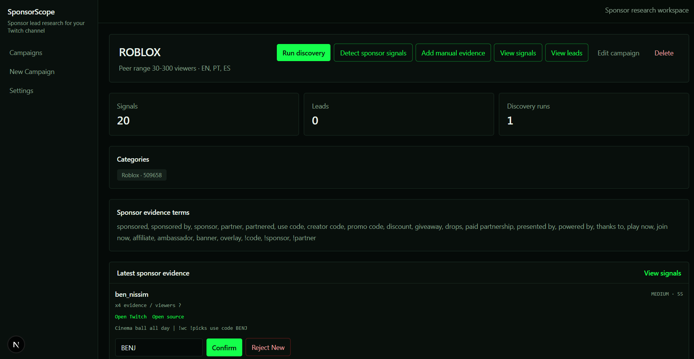

# SponsorScope

[](https://github.com/HanuBehr/SponsorScope/actions/workflows/ci.yml)


SponsorScope is a sponsor discovery dashboard I built for a specific Twitch creator workflow: finding brands already sponsoring peer channels, reviewing the evidence, and exporting outreach-ready rows to Google Sheets.

It is intentionally a homebrew market research tool: official APIs, deterministic scoring, and manual review instead of browser scraping, AI lead scoring, or automated outreach.

<p align="center">
  
</p>

<p>
  <a href="#local-development"><strong>Run locally</strong></a> ·
  <a href="#product-workflow"><strong>Product workflow</strong></a> ·
  <a href="#technical-highlights"><strong>Technical highlights</strong></a>
</p>

## At A Glance

- Twitch Helix ingestion for peer-channel discovery by category, viewer range, and language.
- Deterministic sponsor-evidence scoring with grouped channel-level review.
- Append-only Google Sheets export that preserves a preformatted outreach tracker.

## What It Does

- Creates research campaigns around a Twitch niche or category.
- Discovers live peer channels and recent VOD metadata through Twitch Helix.
- Detects sponsor evidence in stream titles, VOD titles, VOD descriptions, and manual entries.
- Groups evidence by peer channel so review does not become duplicate-signal noise.
- Lets an operator confirm useful sponsor signals into outreach-ready leads.
- Captures manual evidence from panels, chat commands, YouTube descriptions, Discord posts, Linktree/Beacons, overlays, and other sources.
- Exports confirmed, unexported leads to Google Sheets.

## Product Workflow

1. Create a research campaign.
2. Add Twitch categories, viewer range, languages, and sponsor evidence terms.
3. Run discovery for peer Twitch channels.
4. Detect sponsor evidence from stream and VOD metadata.
5. Review grouped evidence by channel.
6. Add manual evidence where needed.
7. Confirm useful sponsor signals as leads.
8. Export confirmed leads to Google Sheets.

## Technical Highlights

- Next.js 15 App Router with server actions for campaign, review, export, and evidence workflows.
- TypeScript and Prisma over a PostgreSQL/Supabase data model for campaigns, channels, discovery runs, signals, leads, and export logs.
- Twitch Helix API integration for live stream and VOD metadata.
- Google Sheets API integration with append-only row export and tab routing.
- Deterministic sponsor evidence scoring with Vitest coverage.
- Zod validation for environment/configuration boundaries.
- Responsive Matrix-inspired operator UI built with TailwindCSS.

## Architecture Notes

The V1 architecture is deliberately direct and easy to reason about:

- Twitch API code lives in `src/lib/twitch`.
- Google Sheets code lives in `src/lib/sheets`.
- Sponsor scoring code lives in `src/lib/scoring`.
- Prisma is used server-side only.
- Review and export workflows run through Next.js server actions.
- Scoring is deterministic and testable rather than AI-dependent.

## Tech Stack

- Next.js 15 App Router
- React
- TypeScript
- TailwindCSS
- Prisma
- PostgreSQL / Supabase
- Twitch Helix API
- Google Sheets API
- Zod
- Vitest

## Google Sheets Export Contract

SponsorScope assumes the destination spreadsheet is already formatted for outreach tracking. It only appends rows and avoids overwriting template/header content.

- Required tabs: `ROBLOX`, `General Gaming`, `Gambling`.
- Export range starts at `B8:I`.
- Column A is left untouched.
- Rows 1-7 are left untouched.
- Export uses `spreadsheets.values.append` with `USER_ENTERED` and `INSERT_ROWS`.
- Leads route to a tab based on source game/category context.

## Local Development

Install dependencies:

```bash
npm install
```

Create `.env` from `.env.example`, then fill in the required values.

Apply migrations:

```bash
npm run prisma:migrate
```

Seed demo data:

```bash
npm run db:seed
```

Start the dev server:

```bash
npm run dev
```

Open `http://localhost:3000`.

## Environment Variables

```env
DATABASE_URL=""
TWITCH_CLIENT_ID=""
TWITCH_CLIENT_SECRET=""
GOOGLE_SERVICE_ACCOUNT_EMAIL=""
GOOGLE_PRIVATE_KEY=""
GOOGLE_SHEETS_SPREADSHEET_ID=""
```

`GOOGLE_PRIVATE_KEY` may contain escaped newlines like `\n`; the app normalizes them before creating the Google client.

## Setup Notes

- For Supabase, Prisma usually works best with the session pooler on port `5432`.
- URL encode the Supabase password if it contains special characters.
- Twitch credentials come from a Twitch Developer Console app using server-side client credentials auth.
- Google Sheets export requires a service account with Editor access to the target spreadsheet.

## Useful Scripts

```bash
npm run dev
npm run build
npm test
npm run prisma:generate
npm run prisma:migrate
npm run db:seed
```

## Testing

Run scoring tests:

```bash
npm test
```

Run a production build:

```bash
npm run build
```

## Demo Checklist

- Open the homepage and campaign registry.
- Create or open a research campaign.
- Run Twitch discovery.
- Detect sponsor signals.
- Review grouped peer-channel evidence.
- Add manual evidence.
- Confirm a sponsor signal as a lead.
- Open the leads page.
- Export unexported leads to Google Sheets.

## What This Demonstrates

- Building a full-stack workflow tool around a real creator/business use case.
- Designing a data model for campaigns, channels, discovery runs, evidence signals, leads, and export logs.
- Integrating third-party APIs with server-side service boundaries.
- Using deterministic scoring to reduce noisy sponsor evidence review.
- Creating an append-only export workflow that respects a preformatted business tracker.
- Keeping V1 practical instead of adding unnecessary infrastructure.

## Notes

SponsorScope is a market research dashboard and lead intelligence tool. It does not use browser scraping, automated outreach, email enrichment, auth, payments, Redis, BullMQ, or AI-generated lead scoring in V1.
